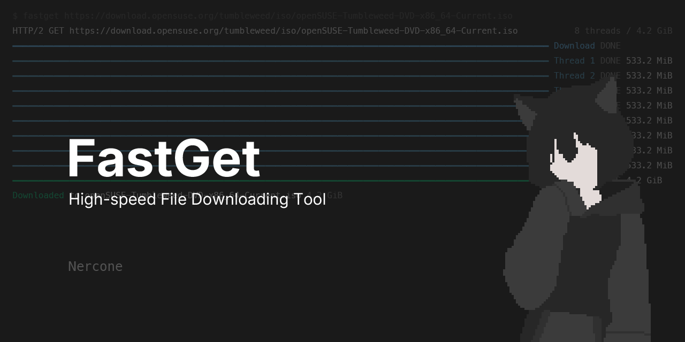

# FastGet
High-speed File Downloading Tool

## How it works?
FastGet uses the HTTP Range header to download files in parallel by splitting them into multiple blocks.

This allows for high-speed downloads in environments with high bandwidth.

The downside is that it cannot be used if the server does not support the Range header, and it requires sufficient bandwidth availability on both the server and the client side.

## Usage
```
$ fastget --help                                                                                 
usage: fastget [-h] [-o OUTPUT] [-t THREADS] url

High-speed File Downloading Tool

positional arguments:
  url                   URL to download

options:
  -h, --help            show this help message and exit
  -o OUTPUT, --output OUTPUT
                        Output file path (default: filename from URL)
  -t THREADS, --threads THREADS
                        Number of download threads (default: 8)
```

```
$ fastget https://download.opensuse.org/tumbleweed/iso/openSUSE-Tumbleweed-DVD-x86_64-Current.iso
HTTP/2 GET https://download.opensuse.org/tumbleweed/iso/openSUSE-Tumbleweed-DVD-x86_64-Current.iso           8 threads / 4.2 GiB
━━━━━━━━━━━━━━━━━━━━━━━━━━━━━━━━━━━━━━━━━━━━━━━━━━━━━━━━━━━━━━━━━━━━━━━━━━━━━━━━━━━━━━━━━━━━━━━━━━━━━━━━ Download DONE
━━━━━━━━━━━━━━━━━━━━━━━━━━━━━━━━━━━━━━━━━━━━━━━━━━━━━━━━━━━━━━━━━━━━━━━━━━━━━━━━━━━━━━━━━━━━━━━━━━━━━━━━ Thread 1 DONE 533.2 MiB
━━━━━━━━━━━━━━━━━━━━━━━━━━━━━━━━━━━━━━━━━━━━━━━━━━━━━━━━━━━━━━━━━━━━━━━━━━━━━━━━━━━━━━━━━━━━━━━━━━━━━━━━ Thread 2 DONE 533.2 MiB
━━━━━━━━━━━━━━━━━━━━━━━━━━━━━━━━━━━━━━━━━━━━━━━━━━━━━━━━━━━━━━━━━━━━━━━━━━━━━━━━━━━━━━━━━━━━━━━━━━━━━━━━ Thread 3 DONE 533.2 MiB
━━━━━━━━━━━━━━━━━━━━━━━━━━━━━━━━━━━━━━━━━━━━━━━━━━━━━━━━━━━━━━━━━━━━━━━━━━━━━━━━━━━━━━━━━━━━━━━━━━━━━━━━ Thread 4 DONE 533.2 MiB
━━━━━━━━━━━━━━━━━━━━━━━━━━━━━━━━━━━━━━━━━━━━━━━━━━━━━━━━━━━━━━━━━━━━━━━━━━━━━━━━━━━━━━━━━━━━━━━━━━━━━━━━ Thread 5 DONE 533.2 MiB
━━━━━━━━━━━━━━━━━━━━━━━━━━━━━━━━━━━━━━━━━━━━━━━━━━━━━━━━━━━━━━━━━━━━━━━━━━━━━━━━━━━━━━━━━━━━━━━━━━━━━━━━ Thread 6 DONE 533.2 MiB
━━━━━━━━━━━━━━━━━━━━━━━━━━━━━━━━━━━━━━━━━━━━━━━━━━━━━━━━━━━━━━━━━━━━━━━━━━━━━━━━━━━━━━━━━━━━━━━━━━━━━━━━ Thread 7 DONE 533.2 MiB
━━━━━━━━━━━━━━━━━━━━━━━━━━━━━━━━━━━━━━━━━━━━━━━━━━━━━━━━━━━━━━━━━━━━━━━━━━━━━━━━━━━━━━━━━━━━━━━━━━━━━━━━ Thread 8 DONE 533.2 MiB
━━━━━━━━━━━━━━━━━━━━━━━━━━━━━━━━━━━━━━━━━━━━━━━━━━━━━━━━━━━━━━━━━━━━━━━━━━━━━━━━━━━━━━━━━━━━━━━━━━━━━━━━ Merge    DONE 4.2 GiB
Downloaded to openSUSE-Tumbleweed-DVD-x86_64-Current.iso 4.2 GiB
```

## Installation

### uv (recommended)
```
uv tool install nercone-fastget
```

### pip3

**System Python:**
```
pip3 install nercone-fastget --break-system-packages
```

**Venv Python:**
```
pip3 install nercone-fastget
```

## Update

### uv
```
uv tool install nercone-fastget --upgrade
```

### pip3

**System Python:**
```
pip3 install nercone-fastget --upgrade --break-system-packages
```

**Venv Python:**
```
pip3 install nercone-fastget --upgrade
```
